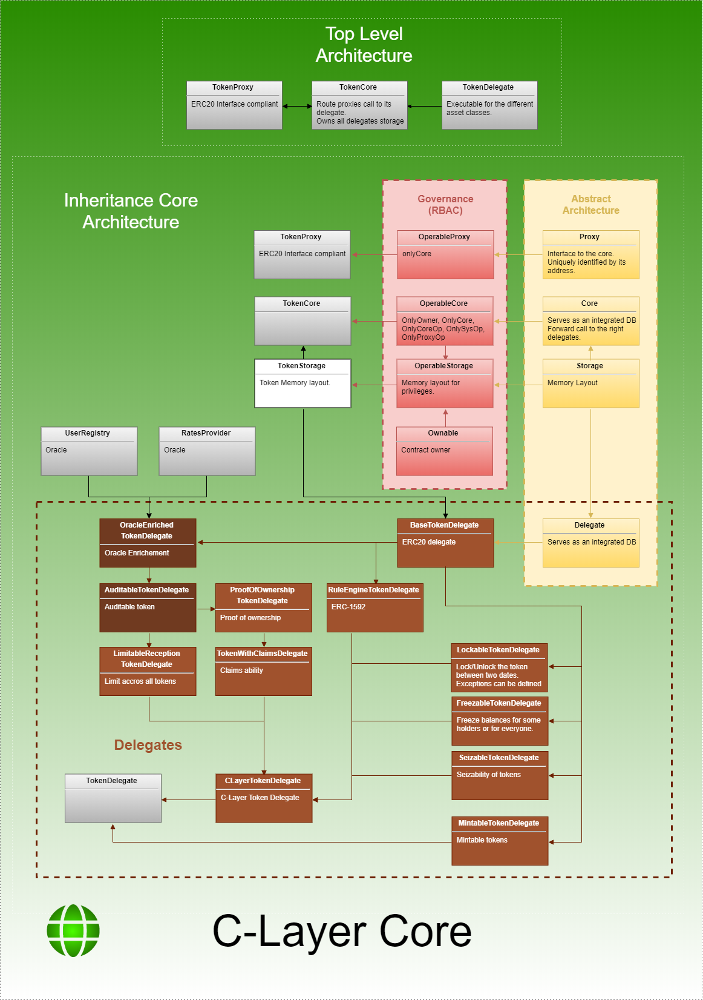
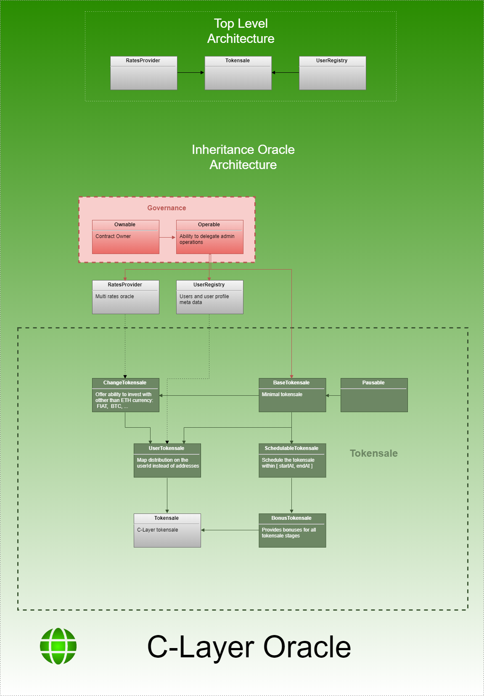

# Compliance Layer SmartContracts

Welcome to the C-Layer Ethereum monorepo.

## Purpose

Provide an administrable layer over the Ethereum blockchain protocol.

One of the foremost use case is the support of regulated asset classes and financial services.

## Content

### Audit Phase 1 limitations

The Audit Phase 1 concerneed only the Core and the Oracle monorepos.
In particular the goal of this phase 1 is to audit a limited version of the C-Layer for Payment Token only.

To this regard, the core only accepts in this version a fixed list of delegates defined at the Core deployment time.
AuditData is also limited to the delegates configuration and cannot be updated.

Remaining tasks to prior to the audit:
- Review and validates AuditData storage
- AuditTokenDelegate must read AuditConfig and update AuditStorage accordingly,
- Rely on token's Audit to eval Tokensale contributions,
- Add more documentations,
- Testing. Coverage up to 90% at least.

### C-Layer Core

Currently, the C-Layer supports the tokenization of the following assets: Bonds, Equity, Payment and Utility.

The token is represented by a proxy contract which implements the ERC20 interface.
The token rely on a core for all operations and in particular transfers.

The core has three roles:
  - Routing proxy call to the relevant token delegates. A delegate contains the code for operations.
    One delegate represent one asset class.
  - Database. All tokens data are stored within the core contract.
    This ensure that cross tokens operations are inherently safe and consistent in respect to the compliance.
  - Security. The core responsability is critical.
    Therefore access control can be precisely defined through a full role base access control.

There is many delegates possible through a combination of existing delegates.
The primary one will be the C-Layer Delegate Token which contains all the requirements for a regulated asset.
However, the C-Layer Delegate Token does not define the supply generation and should be associated usualy with either with the Mintable Token Delegate.

Token Delegates include the following features:
  - Operable: provide an owner and ability to delegate restricted features to operators
  - Auditability: track sendings and receiptions
  - Proofs of ownership: store balance history within Ethereum state
  - Rule Engine: ERC-1592 (see below)
  - Claims: provides claims based on token balance or generated proofs of ownership
  - Seize: authorize operators to seize any tokens. Any seizure will emit a Seize events in the Ethereum history.

Following [ERC-1592](https://github.com/ethereum/EIPs/blob/master/EIPS/eip-1592.md), the token contains a rule engine.
It allows to plug rules which follow the IRule interface implementations.
Available rules are:
  - YesNoRule: accept or refuse all transfers (used for testing)
  - UserRule: lock all addresses which are not contains within a specified user registry.

### C-Layer Oracle

Three oracles are provided:
  - UserRegistry: contains a list of users alongs with their respective profiling informations.

  - RatesProvider: contains a list of rates for many pairs. Rates history is available through events search.

  - Tokensale: provides a way to operate a tokensale with happend both in FIAT (centralized) and in ETH (decentralized).
    The tokensale provides also the following features:
      - Contribution limitations based on a user profiles in user registry oracle
      - Automatic conversion from ETHER to FIAT through a rates provider oracle
      - Pre allocations of tokens to specific investors
      - Onchain SPA aggrement (defined as not mandatory)
      - Bonus provided until a certain dates

