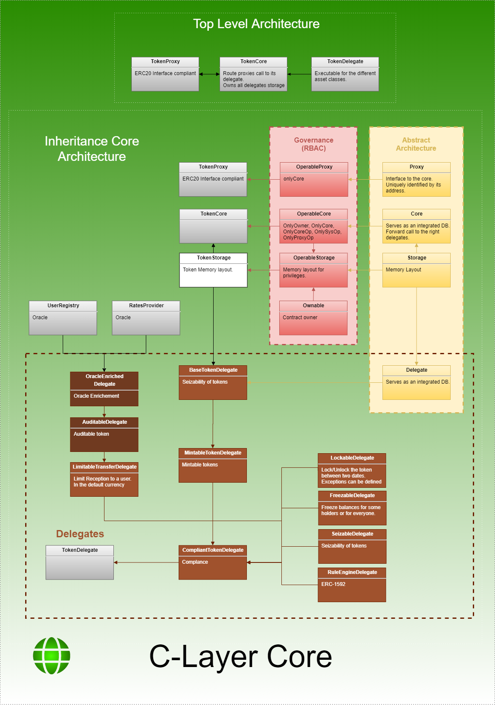

# Compliance Layer Token

## Content

The current version of the C-Layer can support the tokenization of many assets: Bonds, Equity, Payment and Utility.

The token is represented by a proxy contract which implements the ERC20 interface.
The token rely on a core for all operations and in particular transfers.

The core has three roles:
  - Routing proxy call to the relevant token delegates. A delegate contains the code for all the operations.
    One delegate represent one asset class.
  - Database. All tokens data are stored within the core contract.
    This ensure that cross tokens operations are inherently safe and consistent in respect to the compliance.
  - Security. This core responsability is critical.
    Access control can be precisely managed through an integrated role base access control.

Many delegates are possible through a combination of existing delegates.
The primary one will be the C-Layer Delegate Token which contains all the requirements for a regulated asset.
However, the C-Layer Delegate Token does not define the supply generation and may be inherited with the Mintable Token Delegate.

Token Delegates include the following features:
  - Operable: provide an owner and ability to delegate restricted features to operators
  - Auditability: track sendings and receiptions
  - Rule Engine: ERC-1592 (see below)
  - Lock: prevents transfer during a period of time while allowing exceptions
  - Freeze: prevents transferability of certain addresses for a certain amount of time
  - Seize: authorize operators to seize any tokens. Any seizure will emit a Seize events in the Ethereum history.

Following [ERC-1592](https://github.com/ethereum/EIPs/blob/master/EIPS/eip-1592.md), the token contains a rule engine.
It allows to plug rules which follow the IRule interface implementations.
Available rules are:
  - YesNoRule: accept or refuse all transfers (used for testing)
  - UserRule: lock all addresses which are not contains within a specified user registry.

